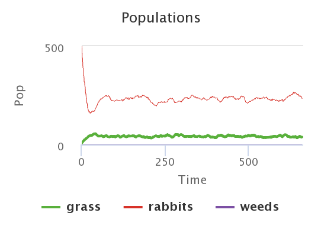
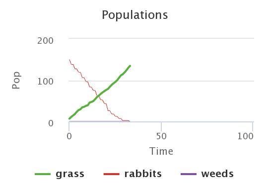
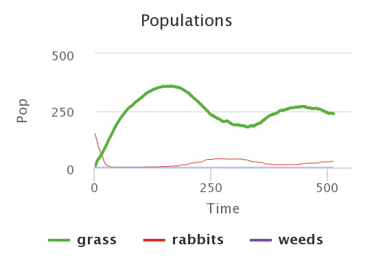
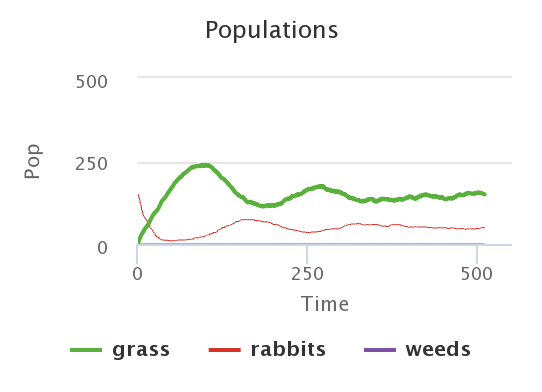
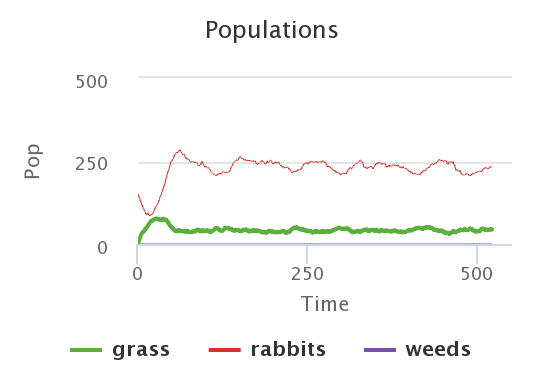
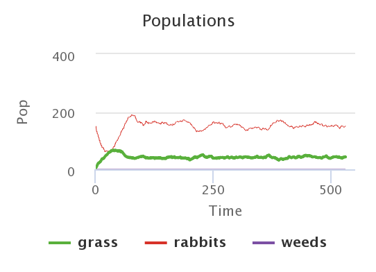
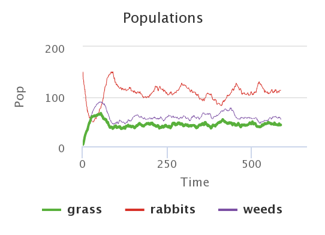
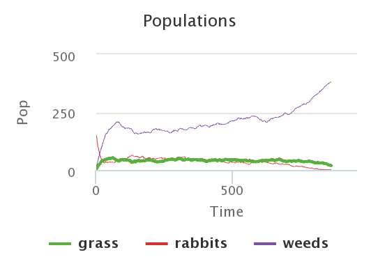

## Комп'ютерні системи імітаційного моделювання
## СПм-22-3, **Растєгаєв Роман Іванович**
### Лабораторна робота №**1**. Опис імітаційних моделей та проведення обчислювальних експериментів

<br>

### Варіант 6, модель у середовищі NetLogo:
[Rabbits Grass Weeds](http://www.netlogoweb.org/launch#http://www.netlogoweb.org/assets/modelslib/Sample%20Models/Biology/Rabbits%20Grass%20Weeds.nlogo)

<br>

### Вербальний опис моделі:
Симуляція основних принципів взаємодій у спільноті організмів. Модель передбачає існування трьох основних компонентів в екосистемі: трава (надає їжу кроликам), кролики (харчуються травою як своєю основною їжею) та бурʼян (рослини, які можуть конкурувати з травою за ресурси, але не є головною їжею для кроликів). У цій моделі екосистеми взаємодії між цими трьома компонентами можуть бути використані для вивчення екологічних концепцій, таких як динаміка популяцій, взаємодія хижак-жертва і вплив конкуренції між видами рослин.

### Керуючі параметри:
- **number-of-rabbits** визначає кількість агентів у середовищі моделювання, тобто, в даній моделі, початкова кількість кроликів.
- **birth-threshold** визначає кількість енергії, необхідної агенту для репродукції.
- **grass-grow-rate** визначає темп зростання трави з кожним ігровим тактом.
- **grass-energy** визначає кількість енергії, яку отримує кролик споживаючи траву.
- **weeds-grow-rate** визначає темп зростання бурʼяну в кожному ігровому такті.
- **weeds-energy** визначає кількість енергії, яку отримує кролик споживаючи бурʼян.

### Внутрішні параметри:
- **initial-energy**. Початкове значення енергії агента. Назначається випадковим шляхом для кожного агента (від 0 до 10).
- **energy**. Поточне значення енергії агента. Може відрізнятись у кожного агента в різні моменти модельного часу.
- **move-energy-loss-substrahend**. Кількість енергії, яка віднімається від енергії агента з кожним рухом в пошуку їжі. В поточній моделі це значення незмінне і дорівнює 0.5.
- **reproduction-energy-loss-coefficient**. Коефіцієнт втрати енергії агентом при репродукції. В даній моделі це значення незмінне і дорівнює 0.5 (при репродукції кролик втрачає половину своєї енергії).

### Показники роботи системи:
- поточна кількість трави,
- поточна кількість бурʼяну,
- поточна популяція кроликів.

### Примітки:
При налаштуваннях керуючих параметрів за замовчуванням, популяція кроликів різко падає, потім помітний різкий стрибок в популяції і далі вона нормалізується.

### Недоліки моделі:
- кролик рухається рандомно в "полі" (тобто не шукає їжу, а рандомно "стрибає" по клітинкам),
- початкове значення енергії кролика - рандомне, що може вплинути на хід експерименту (наприклад через низькі початкові значення енергії в деяких випадках популяція кроликів може закінчитися).
<br>

## Обчислювальні експерименти
### 1. Вплив почтакової кількості кроликів на полі на їхню подальшу популяцію
Досліджується залежність середнього значення популяції кроликів протягом певної кількості тактів (500) від початкової кількості кроликів, зазначеної на початку симуляції.
Експерименти проводяться для значень 150-500, з кроком 50, усього 8 симуляцій.  
Інші керуючі параметри мають значення за замовчуванням:
- **birth-threshold**: 15.
- **grass-grow-rate**: 15.
- **grass-energy**: 5.
- **weeds-grow-rate**: 0.
- **weeds-energy**: 0.

<table>
<thead>
<tr><th>Кількість кроликів</th><th>Середня популяція</th></tr>
</thead>
<tbody>
<tr><td>150</td><td>220</td></tr>
<tr><td>200</td><td>220</td></tr>
<tr><td>250</td><td>230</td></tr>
<tr><td>300</td><td>230</td></tr>
<tr><td>350</td><td>230</td></tr>
<tr><td>400</td><td>230</td></tr>
<tr><td>450</td><td>230</td></tr>
<tr><td>500</td><td>230</td></tr>
</tbody>
</table>

<br>
Наведено графік останньої симуляції, де *number-of-rabbits* дорівнює 500.
Графік наочно показує, що початкова кількість кроликів не впливає на середню популяцію, а керуючі параметри за замовчуванням гарантують майже незмінне значення популяції кроликів.
В якості експерименту також було перевірено значення **number-of-rabbits**=20. Результат ідентичний.

### 2. Вплив енергії, яку дає трава при споживанні, на популяцію кроликів
Досліджується залежність середнього значення популяції кроликів протягом певної кількості тактів (500) від енергії, яку дає трава при її споживанні.
Експерименти проводяться для значень 1-5, з кроком 0.5, усього 9 симуляцій.  
Інші керуючі параметри мають значення за замовчуванням:
- **number-of-rabbits**: 150.
- **birth-threshold**: 15.
- **grass-grow-rate**: 15.
- **weeds-grow-rate**: 0.
- **weeds-energy**: 0.

<table>
<thead>
<tr><th>Енергія від споживання трави</th><th>Середня популяція</th></tr>
</thead>
<tbody>
<tr><td>1</td><td>20 (0)</td></tr>
<tr><td>1.5</td><td>48</td></tr>
<tr><td>2</td><td>68</td></tr>
<tr><td>2.5</td><td>99</td></tr>
<tr><td>3</td><td>130</td></tr>
<tr><td>3.5</td><td>148</td></tr>
<tr><td>4</td><td>175</td></tr>
<tr><td>4.5</td><td>208</td></tr>
<tr><td>5</td><td>230</td></tr>
</tbody>
</table>

**grass-energy**=1<br>

<br>
**grass-energy**=2<br>
<br>
**grass-energy**=5<br>
<br>

Наведені графіки показують, що середня популяція кроликів безпосередньо залежить від енергії, яку дає трава при її споживанні. 
Ця залежність приблизно лінійна, якщо враховувати лише дані цього експерименту. 
Також цікавим виявилося те, що при **grass-energy**=1 в деяких випадках популяція кроликів зупинялася. 
Це відбувається через недоліки поточної моделі: кролики не "шукають" їжу, а рандомно пересуваються полем.

### 3. Вплив бурʼяну на популяцію кроликів

В контексті моделі "Rabbits Grass Weeds" бур'яни зазвичай представляють рослини, які можуть конкурувати з травою за ресурси, але не є (головною) їжею для кроликів. 
Бур'яни часто вважаються небажаними рослинами в екосистемі та можуть впливати на ріст як трави, так і інших видів рослин.
Однак, в коді поточної моделі трава має перевагу (тобто якщо для однієї ячейки обидві умови виконуються (для трави і бурʼяну), то в цій ячейці виросте трава):
```
to grow-grass-and-weeds
  ask patches [
    if pcolor = black [
      if random-float 1000 < weeds-grow-rate
        [ set pcolor violet ]
      if random-float 1000 < grass-grow-rate
        [ set pcolor green ]
    ]
  ]
end
```
Змінимо код, щоб це працювало навпаки, таким чином зімітуємо негативний вплив бурʼяну на ріст трави:
```
to grow-grass-and-weeds
  ask patches [
    if pcolor = black or pcolor = green [
      if random-float 1000 < grass-grow-rate
        [ set pcolor green ]
      if random-float 1000 < weeds-grow-rate
        [ set pcolor violet ]
    ]
  ]
end
```
Досліджується негативний вплив бурʼяну на середню популяцію кроликів протягом певної кількості тактів (500).
Експерименти проводяться для значень 0-20, з кроком 2, усього 10 симуляцій.
Для наглядності зменшимо значення **grass-grow-rate** до 10.
Інші керуючі параметри мають значення за замовчуванням:
- **number-of-rabbits**: 150.
- **birth-threshold**: 15.
- **grass-grow-rate**: 10.
- **grass-energy**: 5.
- **weeds-energy**: 0.

<table>
<thead>
<tr><th>Темп росту бурʼяну</th><th>Середня популяція</th></tr>
</thead>
<tbody>
<tr><td>0</td><td>160</td></tr>
<tr><td>2</td><td>146</td></tr>
<tr><td>4</td><td>136</td></tr>
<tr><td>6</td><td>131</td></tr>
<tr><td>8</td><td>116</td></tr>
<tr><td>10</td><td>106</td></tr>
<tr><td>12</td><td>98</td></tr>
<tr><td>14</td><td>85</td></tr>
<tr><td>16</td><td>72</td></tr>
<tr><td>18</td><td>48</td></tr>
<tr><td>20</td><td>0</td></tr>
</tbody>
</table>

**weed-grow-rate**=0<br>
<br>
**weed-grow-rate**=10<br>
<br>
**weed-grow-rate**=20<br>
<br>

В рамках цього дослідження був виявлений негативний вплив бурʼяну на популяцію кроликів.
В наведених графіках видно, що при темпі росту бурʼяну вдвічі більшого за темп росту трави, популяція кроликів може повністю припинитися.
Це відбувається тільки в тому випадку, коли:
- рост бурʼяну заважає росту трави,
- кролики не споживають бурʼян в якості їжі.<br>

[Посилання на nlogo файл](_model.nlogo)
