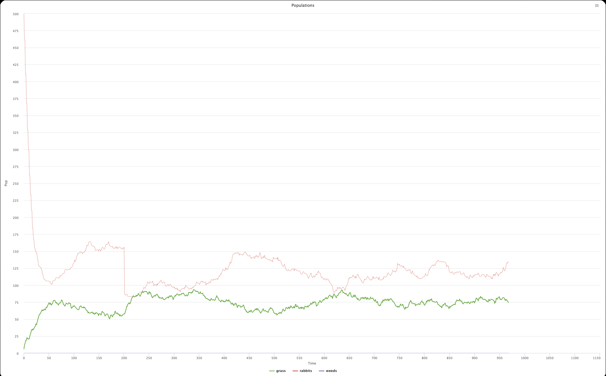
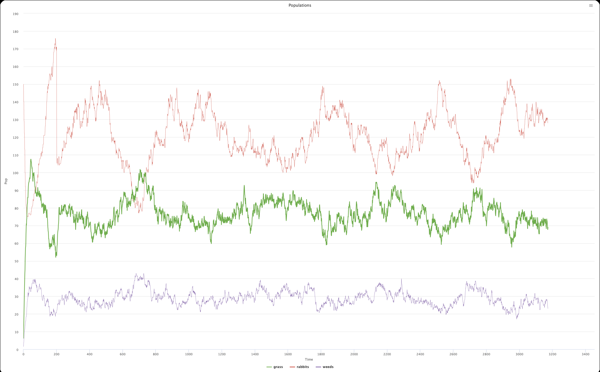
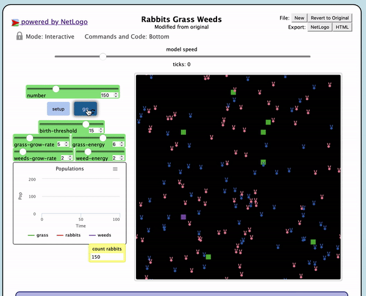

## Комп'ютерні системи імітаційного моделювання
## СПм-22-3, **Растєгаєв Роман Іванович**
### Лабораторна робота №**2**. Редагування імітаційних моделей у середовищі NetLogo

 

### Варіант 6, модель у середовищі NetLogo:
[Rabbits Grass Weeds](http://www.netlogoweb.org/launch#http://www.netlogoweb.org/assets/modelslib/Sample%20Models/Biology/Rabbits%20Grass%20Weeds.nlogo)

 

### Вербальний опис моделі:
Симуляція основних принципів взаємодій у спільноті організмів. Модель передбачає існування трьох основних компонентів в екосистемі: трава (надає їжу кроликам), кролики (харчуються травою як своєю основною їжею) та бурʼян (рослини, які можуть конкурувати з травою за ресурси, але не є головною їжею для кроликів). У цій моделі екосистеми взаємодії між цими трьома компонентами можуть бути використані для вивчення екологічних концепцій, таких як динаміка популяцій, взаємодія хижак-жертва і вплив конкуренції між видами рослин.

### Керуючі параметри:
- **number-of-rabbits** визначає кількість агентів у середовищі моделювання, тобто, в даній моделі, початкова кількість кроликів.
- **birth-threshold** визначає кількість енергії, необхідної агенту для репродукції.
- **grass-grow-rate** визначає темп зростання трави з кожним ігровим тактом.
- **grass-energy** визначає кількість енергії, яку отримує кролик споживаючи траву.
- **weeds-grow-rate** визначає темп зростання бурʼяну в кожному ігровому такті.
- **weeds-energy** визначає кількість енергії, яку отримує кролик споживаючи бурʼян.

### Внутрішні параметри:
- **initial-energy**. Початкове значення енергії агента. Назначається випадковим шляхом для кожного агента (від 0 до 10).
- **energy**. Поточне значення енергії агента. Може відрізнятись у кожного агента в різні моменти модельного часу.
- **move-energy-loss-substrahend**. Кількість енергії, яка віднімається від енергії агента з кожним рухом в пошуку їжі. В поточній моделі це значення незмінне і дорівнює 0.5.
- **reproduction-energy-loss-coefficient**. Коефіцієнт втрати енергії агентом при репродукції. В даній моделі це значення незмінне і дорівнює 0.5 (при репродукції кролик втрачає половину своєї енергії).

### Змінимо код згідно варіанту

Обовʼязкові зміни:
- Додати можливість отруїтися при поїданні бур'янів (зазначена у внутрішніх параметрах, як певна вірогідність). Захворілий кролик не може харчуватися, переміщатися і розмножуватися, позначається іншим кольором і залишається хворим на 3 такти модельного часу. 
- Додати поділ кроликів на самців та самок. 
- Поява нових кроликів має вимагати не тільки ситості, а й здоров'я, та присутності в одній із сусідніх клітин іншого ситого здорового кролика протилежної статі. 
- Поява потомства відбувається із ймовірністю 50%.

**Додаткові зміни**:
- Додамо кожному кролику "вік" - кількість тактів, після яких кролик "помирає".
- Зробимо так, щоб тільки кролики жіночої статі могли народжувати. Кролики чоловічої статі тільки втрачають енергію.
- Зробимо так, щоб кролики жіночої статі могли народжувати 1 або 2 кролика (або 0).

Нові внутрішні параметри:
- **age**. Поточне значення віку кролика. Початкове значення 0, інкрементується з кожним тактом. Максимальне значення - 200 після чого кролик помирає.
- **health**. Поточне значення здоровʼя кролика. Початкове значення 3. При отруєнні змінюється на 0 і інкрементується до 3х з кожним тактом.
- **isMale**. Вказує на стать кролика. Призначається рандомно і не змінюється. 

Очевидно, що з такою конфігурацією популяція кроликів буде під загрозою.

### 1. Виконаємо експеримент з першої лабораторної про вплив почтакової кількості кроликів на полі на їхню подальшу популяцію
Нагадаємо, що початкова кількість кроликів не впливала на їхню подальшу популяцію і становила в середньому позначки 230.
Проведемо експеримент для значень 100-500, з кроком 100, усього 5 симуляцій.
Інші керуючі параметри мають значення за замовчуванням:
- **birth-threshold**: 15.
- **grass-grow-rate**: 15.
- **grass-energy**: 5.
- **weeds-grow-rate**: 0.
- **weeds-energy**: 0.

<table>
<thead>
<tr><th>Кількість кроликів</th><th>Середня популяція</th></tr>
</thead>
<tbody>
<tr><td>100</td><td>115</td></tr>
<tr><td>200</td><td>122</td></tr>
<tr><td>300</td><td>120</td></tr>
<tr><td>400</td><td>120</td></tr>
<tr><td>500</td><td>125</td></tr>
</tbody>
</table>

 

Наведено графік останньої симуляції, де **number-of-rabbits** дорівнює 500.
Графік наочно показує, що початкова кількість кроликів не впливає на середню популяцію, але в порівнянні з експериментом з попередньої лабораторної роботи, популяція кроликів майже вдвічі зменшилася.

### 2. Дослідимо, при якій конфігурації керуючих параметрів популяція кроликів становитиме в середньому 120.
Будемо змінювати значення **grass-grow-rate** починаючи з 10 з кроком 1. 
Встановимо також **weed-grow-rate**=5, щоб включити в експеримент вплив захворювання тварин на популяцію. 
Наступні параметри залишимо незмінними:
- **number-of-rabbits**: 150.
- **birth-threshold**: 15.
- **grass-energy**: 5.
- **weeds-energy**: 0.

<table>
<thead>
<tr><th>Темп росту трави</th><th>Середня популяція</th><th>Такт припинення популяції</th></tr>
</thead>
<tbody>
<tr><td>10</td><td>0</td><td>1075</td></tr>
<tr><td>11</td><td>0</td><td>1160</td></tr>
<tr><td>12</td><td>0</td><td>1893</td></tr>
<tr><td>13</td><td>0</td><td>1704</td></tr>
<tr><td>14</td><td>70</td><td>-</td></tr>
<tr><td>15</td><td>90</td><td>-</td></tr>
<tr><td>16</td><td>105</td><td>-</td></tr>
<tr><td>17</td><td>115</td><td>-</td></tr>
<tr><td>18</td><td>121</td><td>-</td></tr>
</tbody>
</table>

**Популяція кроликів при grass-grow-rate=18** 
 

Оскільки фактор захворювання кроликів був включений в експеримент, **grass-grow-rate**=10 стало недостатньо для підтримки популяції кроликів.
Ба більше, ситуацію ускладнює фактор того, що бурʼян має негативний вплив на зростання трави (бурʼян має пріоритет над травою), а також додавання максимального віку кожній тварині.
По таблиці видно, що при значеннях **grass-grow-rate** 10-14 популяція кроликів з часом повністю припиняється.
Значення **grass-grow-rate**=18 вистачає для того, щоб підтримувати популяцію кроликів в середньому 120 осіб. 

[Посилання на nlogo файл](_model.nlogo) 

### Презентація
 
